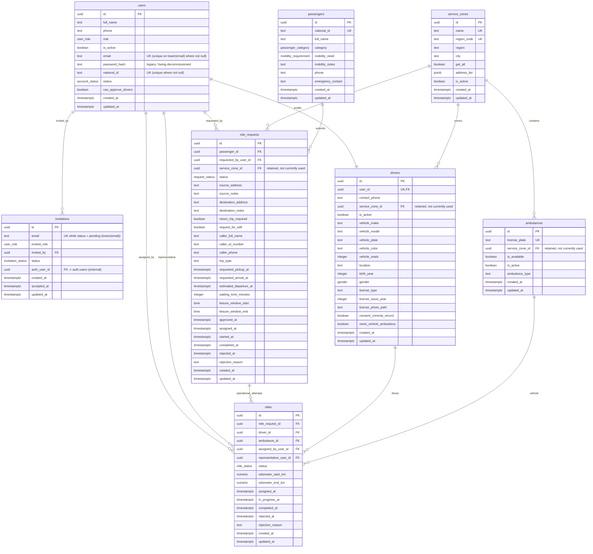

# Savyonim Dispatch ERD

> Regenerated from the live schema on 2026-06-27 (local Docker Supabase, all migrations applied).
> Covers the `public` schema. `auth.*` (Supabase Auth) is external and not drawn.

## Service zones (kept, currently unused)

`service_zones` and the `service_zone_id` foreign keys on `drivers`, `ambulances`, and
`ride_requests` are **intentionally retained in the database** for possible future use, but the
application does **not** use zone-based routing today (zones are out of MVP scope). They are kept so
the feature can be re-enabled later without a schema migration.

## Operational helper table (not shown above)

- `keep_alive` (`id` PK) — a small table written by the keep-alive cron so the hosted database isn't
  paused for inactivity. No relationships; not part of the domain model.

## Status flow

`ride_requests.status` lifecycle:

`pending -> approved -> waiting_for_representative -> in_progress -> completed`

`rides.status` lifecycle:

`assigned -> in_progress -> completed`

Either may transition to `rejected` from any non-terminal state per business handling.

## Race-condition guardrails

Partial unique indexes on `rides` block conflicting concurrent assignments at the DB level:

- `ux_rides_active_request` — one active ride per `ride_request_id` where status is `assigned` or `in_progress`.
- `ux_rides_active_ambulance` — one active ride per `ambulance_id` where status is `assigned` or `in_progress`.

Other conditional unique indexes:

- `users` — unique `lower(email)` where email is not null (`ux_users_email_lower`); unique `national_id` where not null (`unique_national_id`).
- `invitations` — unique `lower(email)` while `status = 'pending'` (`unique_pending_email`).

## Enum values

- `user_role`: `admin`, `driver`, `representative`
- `account_status`: `pending`, `approved`, `rejected`
- `invitation_status`: `pending`, `accepted`, `expired`, `revoked`
- `gender`: `male`, `female`, `other`, `prefer_not_to_say`
- `passenger_category`: `wounded_soldier`, `idf_disabled`, `holocaust_survivor`, `cancer_patient`, `dialysis_patient`, `other`
- `mobility_requirement`: `none`, `wheelchair`, `walker`, `cane`, `walking`
- `request_status`: `pending`, `approved`, `waiting_for_representative`, `in_progress`, `completed`, `rejected`
- `ride_status`: `assigned`, `in_progress`, `completed`, `rejected`
