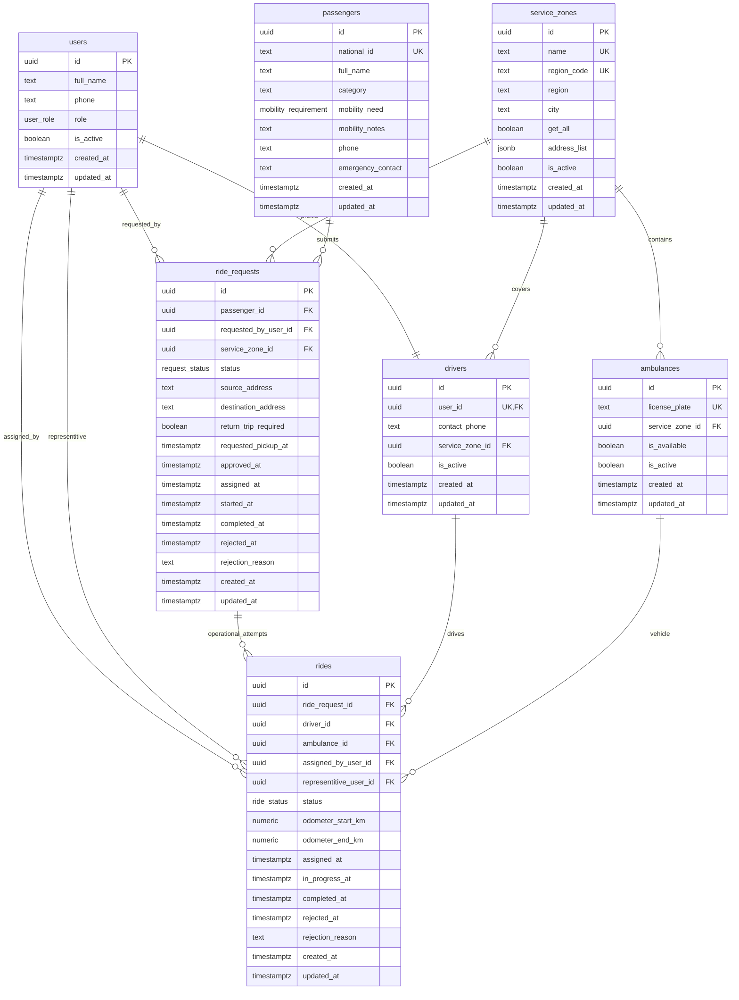

# Savyonim Dispatch ERD

## Status Flow

`ride_requests.status` is constrained to this lifecycle:

`pending -> approved -> waiting_for_representitive -> in_progress -> completed`

A request may transition to `rejected` from any non-terminal operational state according to business handling.

## Race-Condition Guardrails

The migration includes partial unique indexes on active rides:

- One active ride per request (`ride_request_id`) where status is `assigned` or `in_progress`.
- One active ride per driver (`driver_id`) where status is `assigned` or `in_progress`.
- One active ride per ambulance (`ambulance_id`) where status is `assigned` or `in_progress`.

These constraints block conflicting concurrent assignments at the database level.

## Enum Values

- `user_role`: `admin`, `dispatcher`, `driver`, `representative`
- `request_status`: `pending`, `approved`, `waiting_for_representitive`, `in_progress`, `completed`, `rejected`
- `mobility_requirement`: `none`, `wheelchair`, `walker`, `cane`
